# Adeetya Upadhyay

**Full Stack Developer & ML Engineer** | **Illinois '27** | **CS, Advertising, Econometrics**

---

## 📊 GitHub Stats

  
  

---

## 🛠️ Tech Stack

### Languages

### Frameworks & Cloud

### Data & ML

---

## 🚀 Featured Projects

---

## 📍 Current Focus

> **Building ML pipelines, full-stack applications, and AI-powered solutions**  
> **Expected graduation: May 2027**  
> **Location:** Champaign, IL | **University:** UIUC | **Status:** Actively Building

---

## 📞 Connect

---

<strong>Acta, non Verba</strong> — Actions, not words

